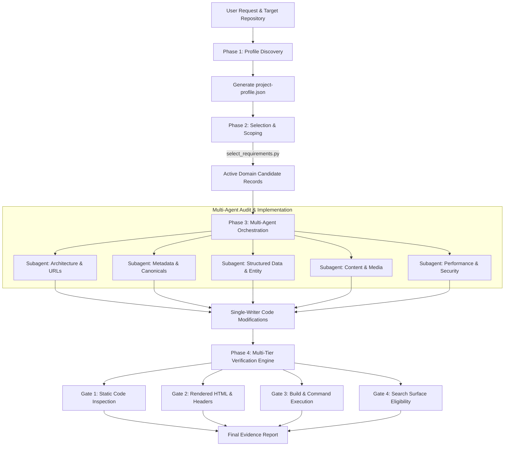
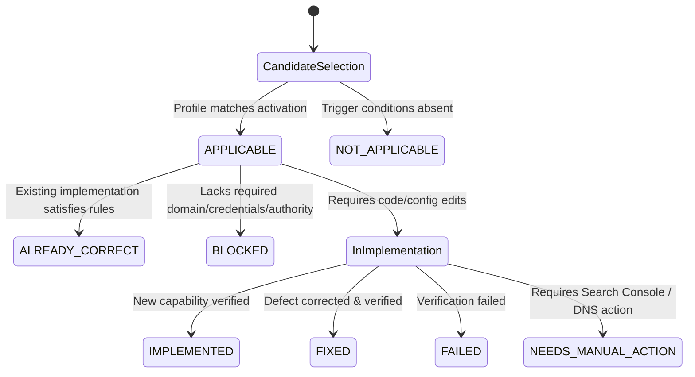

# `web-discoverability-skill` System Architecture & Technical Specification

This document details the software architecture, data models, orchestration mechanics, applicability engine, and verification frameworks powering **`web-discoverability-skill`**.

---

## 📋 Table of Contents

- [Architectural Overview](#architectural-overview)
- [System Pipeline & Data Flow](#system-pipeline--data-flow)
- [Requirement Registry Data Architecture](#requirement-registry-data-architecture)
- [The Applicability Engine](#the-applicability-engine)
- [Multi-Agent Orchestration & Memory Isolation](#multi-agent-orchestration--memory-isolation)
- [Search Surface & AI Discoverability Framework](#search-surface--ai-discoverability-framework)
- [Multi-Tier Verification Engine](#multi-tier-verification-engine)

---

## 🏛️ Architectural Overview

`web-discoverability-skill` is built on a **decoupled, evidence-driven, multi-agent architecture**. It separates high-level workflow orchestration from domain-specific requirement data, ensuring:

1. **Context Window Efficiency**: The main orchestrator ([`SKILL.md`](file:///c:/Users/rocky/OneDrive/Desktop/seo-skill/SKILL.md)) is strictly capped at under 500 lines. Heavy requirement data (640 records across 42 domains) resides in separate machine-readable JSONL files.
2. **Determinism & Stability**: Every requirement possesses a unique, contiguous, stable identifier (`SEO-001` to `SEO-640`).
3. **Multi-Agent Concurrency Safety**: Parallel audit passes read-only shared state, while code modifications strictly enforce single-writer file ownership.

---

## 🔄 System Pipeline & Data Flow



---

## 📦 Requirement Registry Data Architecture

The core knowledge base resides in `requirements/`:

```text
requirements/
├── manifest.json         # Global index, domain metadata, search surfaces, levels
├── coverage-map.json     # Complete taxonomy area mapping
├── registry.md           # Human-readable domain reference
└── *.jsonl               # 42 domain files (1 JSON record per requirement per line)
```

### Data Schema Hierarchy

```text
Manifest Schema (manifest.json)
├── schema_version: 2
├── requirement_count: 640
├── level_candidate_counts: { LITE, RECOMMENDED, EXTRA, ULTRA }
├── domains: Array<{ domain, count, file, activation }>
├── search_surfaces: Array<string>
└── allowed_statuses: Array<string>

Domain Record Schema (*.jsonl)
├── Metadata: id, domain, title, description, why_it_matters
├── Execution: minimum_level, levels, activation, priority
├── Guidance: implementation_guidance, verification_method, evidence_requirement
├── Context: dependencies, conflicts, framework_notes
├── Taxonomy (W5): what, why, who, when, where
├── Surfaces: search_surfaces, google_eligibility, bing_eligibility, ai_discoverability_relevance
└── Classifications: platform_status, official_sources, ai_terms, evidence_types
```

---

## ⚡ The Applicability Engine

The applicability engine evaluates project profile facts against requirement activation triggers to filter non-applicable work before code is touched.

### Activation Triggers & Logic

| Activation Trigger | Rule Condition |
| :--- | :--- |
| **`always`** | Always evaluates to `True`. |
| **`public_site`** | Activated when repository represents a publicly accessible web service. |
| **`has_images`** | Profile has `has_images: true` OR `application_types` includes portfolio, ecommerce, marketplace, media, news. |
| **`has_video`** | Profile has `has_video: true` OR application types include video or media. |
| **`ecommerce`** | Profile has `ecommerce: true` OR `product_catalog: true`. |
| **`local_business`** | Profile has location-based intent or local business entity profile. |
| **`multilingual_or_multiregional`** | Profile has `multilingual: true`, `international: true`, or `language_count > 1`. |
| **`ugc`** | User-generated content, community forums, reviews, or marketplace comments present. |
| **`paywall_or_subscription`** | Membership, gated content, or subscription access controls present. |
| **`content_publication`** | Editorial blog, news, publisher, podcast, or CMS content publishing. |
| **`javascript_app`** | Framework is Next.js, React, Remix, Astro, Vite, Nuxt, SvelteKit, or Vue. |
| **`has_cdn_or_waf`** | Deployed behind Cloudflare, Vercel Edge, Netlify, Fastly, AWS CloudFront, or WAF. |

### Requirement Lifecycle State Machine



---

## 🤖 Multi-Agent Orchestration & Memory Isolation

`web-discoverability-skill` supports parallel execution across subagents while maintaining strict memory and write boundaries:

1. **Read-Only Discovery Parallelism**: Multiple subagents can inspect codebase files concurrently during auditing.
2. **Single-Writer File Locks**: No two agents may edit the same file simultaneously. Primary file owners are assigned per domain (e.g. `Architecture Agent` owns `middleware.ts`; `Metadata Agent` owns `app/layout.tsx`).
3. **Compact State Exchange**: Agents communicate via terse requirement status tuples rather than exchanging large code blobs:
   $$\text{State Record} = \langle \text{ID}, \text{Status}, \text{Evidence Quote}, \text{Target File} \rangle$$

---

## 🌐 Search Surface & AI Discoverability Framework

`web-discoverability-skill` classifies discoverability across two distinct paradigms:

```text
┌────────────────────────────────────────────────────────────────────────┐
│                        Search Surface Taxonomy                         │
├───────────────────────────────────┬────────────────────────────────────┤
│ Traditional Search Engines        │ AI Search & Answer Systems         │
├───────────────────────────────────┼────────────────────────────────────┤
│ • Google Search (Web/Images/Video)│ • ChatGPT / OpenAI Search          │
│ • Google Discover / Top Stories   │ • Claude / Anthropic               │
│ • Bing Search / Yahoo             │ • Perplexity AI                    │
│ • Yandex / Baidu / DuckDuckGo     │ • Google Gemini / AI Overviews     │
│                                   │ • Bing Copilot / Apple Intelligence│
└───────────────────────────────────┴────────────────────────────────────┘
```

### AI Crawler Policy Matrix

`web-discoverability-skill` enforces explicit crawler policy handling in `robots.txt` and edge rules for 9 major AI bots:

1. **`GPTBot`**: OpenAI web crawler for model training.
2. **`OAI-SearchBot`**: OpenAI Search real-time retrieval crawler.
3. **`ChatGPT-User`**: User-triggered real-time fetching inside ChatGPT conversations.
4. **`ClaudeBot`**: Anthropic web crawler for AI services and training.
5. **`PerplexityBot`**: Perplexity AI real-time search indexer.
6. **`Google-Extended`**: Google Gemini training data collection bot (does not affect Google Search indexing).
7. **`Applebot`**: Apple Search & Apple Intelligence crawler.
8. **`Bytespider`**: ByteDance AI search and training bot.
9. **`Amazonbot`**: Amazon AI & product search crawler.

---

## 🔬 Multi-Tier Verification Engine

Implementation claims must pass through up to 4 verification gates:

- **Gate 1: Static Code Inspection**: Direct regex matching, file path verification, and AST code pattern analysis.
- **Gate 2: Rendered Output & Header Verification**: Inspection of DOM nodes, `<head>` element hierarchy, HTTP status codes (`200`, `301`, `308`, `404`), and response headers (`Content-Type`, `Cache-Control`, `X-Robots-Tag`).
- **Gate 3: Automated Command Verification**: Clean execution of project build pipelines (`npm run build`, `next build`), type checks (`tsc`), and test runners.
- **Gate 4: Search Surface & Schema Validity**: JSON-LD schema parsing against Schema.org specifications and official Google Rich Result guidelines.
